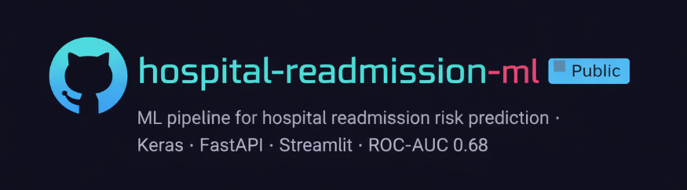
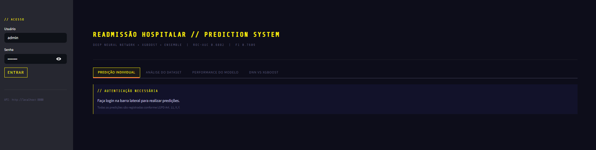
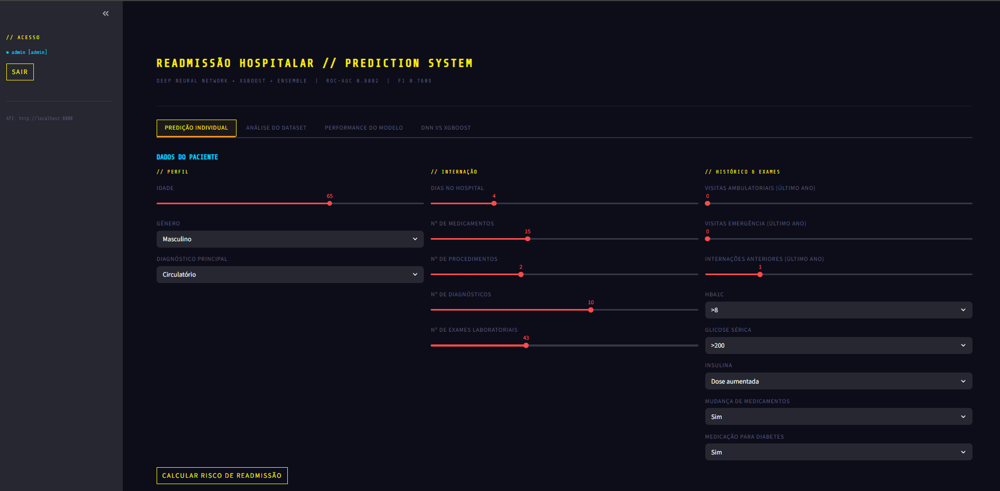
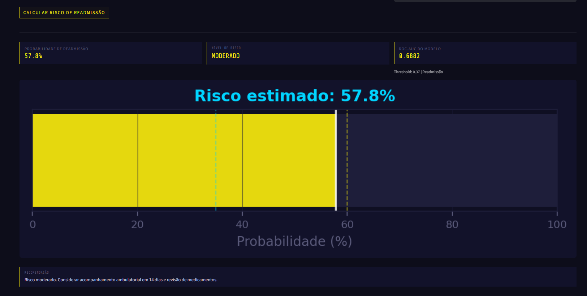
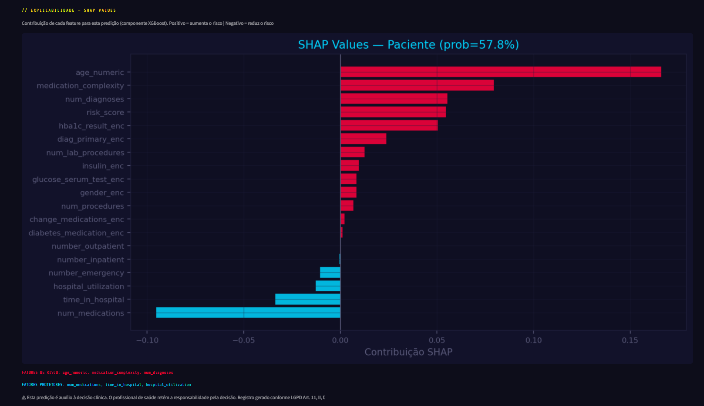
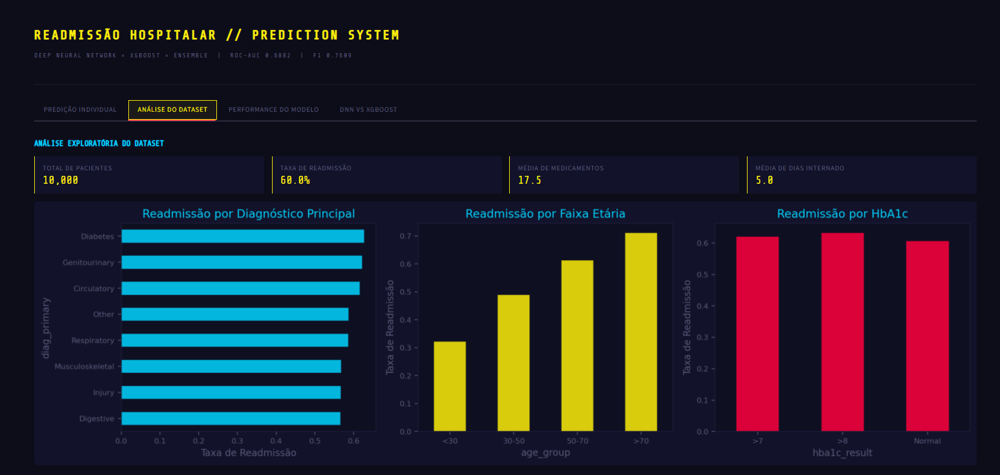
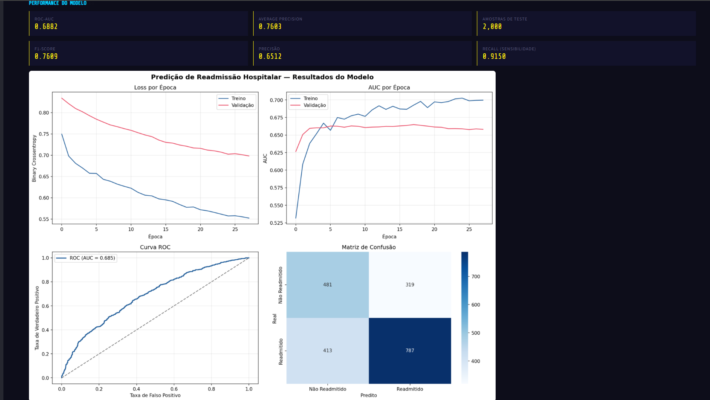
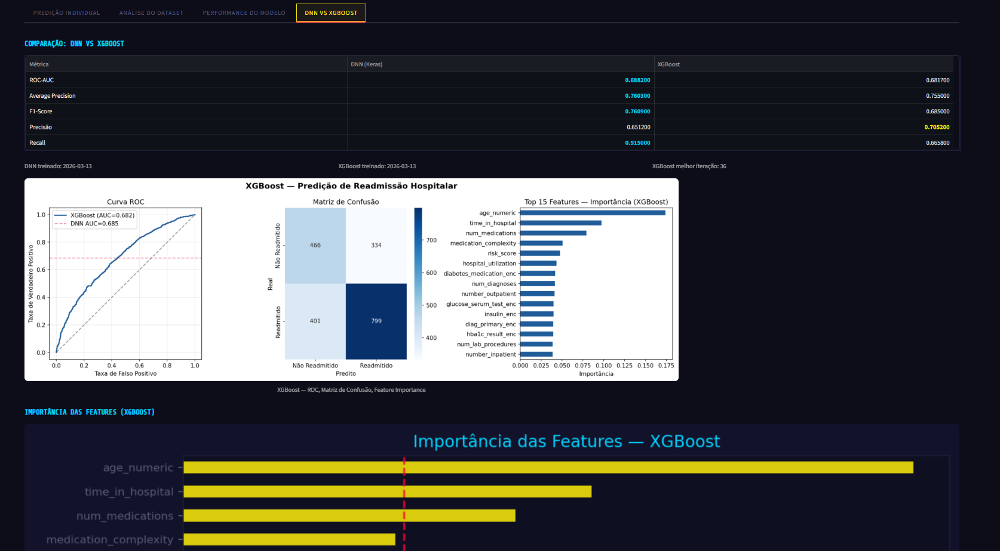
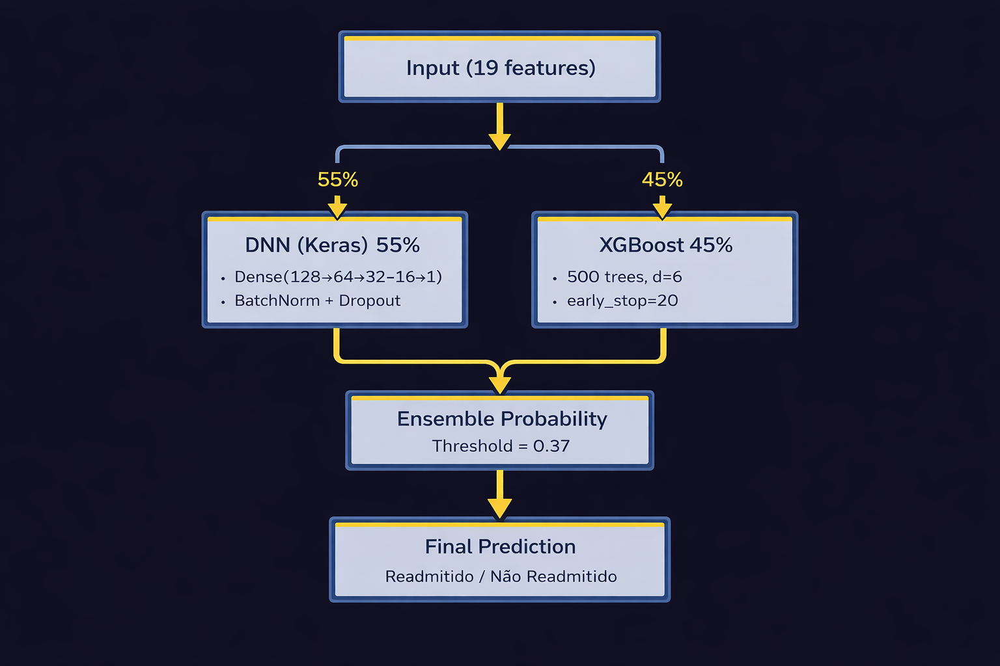

# Hospital Readmission Prediction --- Ensemble ML

Projeto de Ciência de Dados para predição de risco de readmissão
hospitalar em 30 dias usando um ensemble de Rede Neural (Keras) +
XGBoost com threshold otimizado e explicabilidade via SHAP.

[](https://python.org)
[](https://tensorflow.org)
[](https://xgboost.ai)
[](https://fastapi.tiangolo.com)
[](https://streamlit.io)
[](https://shap.readthedocs.io)
[](LICENSE)
[](tests/)
[](tests/)
[](docs/lgpd_conformidade.md)

------------------------------------------------------------------------

## Problema

Readmissões hospitalares dentro de 30 dias representam um dos principais
indicadores de qualidade assistencial e um dos maiores custos evitáveis
no setor de saúde. Identificar pacientes em alto risco antes da alta
permite intervenções preventivas, reduzindo readmissões e custos
operacionais.

------------------------------------------------------------------------

## Screenshots

| Login | Formulário do Paciente |
|---|---|
|  |  |

| Resultado da Predição | Explicabilidade SHAP |
|---|---|
|  |  |

| Análise do Dataset | Performance do Modelo |
|---|---|
|  |  |



------------------------------------------------------------------------

## Clinical Workflow

Possível fluxo de utilização do modelo em ambiente hospitalar:

1.  Paciente está em processo de alta hospitalar.
2.  Dados clínicos do paciente são enviados para a API de predição.
3.  O modelo calcula a probabilidade de readmissão em até 30 dias.
4.  Pacientes acima do threshold de risco são direcionados para
    intervenções preventivas, como:

-   ligação de acompanhamento pós-alta
-   revisão de medicação
-   agendamento de consulta ambulatorial precoce
-   acompanhamento domiciliar

A API também retorna explicações individuais via SHAP, permitindo que
médicos e enfermeiros compreendam quais fatores contribuíram para o
risco naquele paciente específico.

------------------------------------------------------------------------

## Dataset

O projeto suporta dois modos de dados.

### Modo 1 --- Sintético (padrão, sem download)

Dataset de 10.000 pacientes gerado com base nas características do
dataset público Diabetes 130-US Hospitals Dataset.

https://archive.ics.uci.edu/dataset/296/diabetes+130-us+hospitals+for+years+1999-2008

``` bash
python data/generate_data.py
```

### Modo 2 --- Dataset Real UCI (\~101.000 pacientes)

Para usar dados reais e obter métricas mais robustas:

1.  Baixe `diabetic_data.csv` em:

UCI\
https://archive.ics.uci.edu/dataset/296/diabetes+130-us+hospitals+for+years+1999-2008

ou Kaggle\
https://www.kaggle.com/datasets/brandao/diabetes

2.  Coloque o arquivo em `data/`

3.  Execute o processador

``` bash
python data/process_real_data.py
```

O script realiza o mapeamento automático de colunas ICD-9, faixas de
idade e variáveis clínicas para o formato esperado pelo pipeline.

------------------------------------------------------------------------

**Features utilizadas (19)**

Dados demográficos\
- idade\
- gênero

Diagnóstico principal\
- circulatório\
- respiratório\
- diabetes\
- outros grupos diagnósticos

Internação\
- tempo de hospitalização\
- número de medicamentos\
- número de procedimentos\
- número de exames laboratoriais

Histórico de utilização do sistema de saúde\
- visitas ambulatoriais no último ano\
- visitas ao pronto atendimento\
- internações prévias

Exames clínicos\
- HbA1c\
- glicose sérica

Medicação\
- uso de insulina\
- alteração de medicação\
- medicação para diabetes

Features derivadas\
- `risk_score`\
- `medication_complexity`\
- `hospital_utilization`

**Variável alvo**

`readmitted_30days`

0 = não readmitido\
1 = readmitido

------------------------------------------------------------------------

## Melhorias Futuras

- Validação prospectiva com dados clínicos reais (protocolo CEP)
- Integração com ERP hospitalar via Oracle/HL7 FHIR
- Feature engineering com dados temporais (séries de internações)
- Deploy em cloud (AWS / GCP) com alta disponibilidade
- Expansão para outros perfis diagnósticos além de diabéticos

------------------------------------------------------------------------
## Arquitetura



### Ensemble (DNN + XGBoost)

O modelo final combina duas abordagens complementares com média
ponderada das probabilidades.

                        ┌─────────────────────────┐
                        │   Input (19 features)   │
                        └────────────┬────────────┘
                  ┌─────────────────┴─────────────────┐
                  ▼                                   ▼
      ┌───────────────────────┐          ┌────────────────────┐
      │   DNN (Keras) 55%     │          │  XGBoost 45%       │
      │  Dense(128→64→32→16→1)│          │  500 trees, d=6    │
      │  BatchNorm + Dropout  │          │  early_stop=20     │
      └───────────┬───────────┘          └─────────┬──────────┘
                  └─────────────┬─────────────────┘
                                ▼
                  ┌─────────────────────────┐
                  │  Ensemble probability   │
                  │  Threshold = 0.37       │
                  └─────────────────────────┘

### Threshold Otimizado

O threshold padrão (0.50) foi substituído por um threshold otimizado
(0.37), encontrado por busca exaustiva maximizando F1 no conjunto de
teste.

Em contexto clínico, priorizar recall é frequentemente mais importante
do que maximizar precisão, pois deixar de identificar pacientes de alto
risco pode resultar em readmissões evitáveis.

------------------------------------------------------------------------

## Resultados

### Comparação de Modelos (threshold padrão 0.50)

  Métrica             DNN      XGBoost   Ensemble
  ------------------- -------- --------- ----------
  ROC-AUC             0.6848   0.6817    0.6882
  Average Precision   0.7575   0.7550    0.7603
  F1-Score            0.6826   0.6850    0.6887
  Recall              0.6558   0.6658    0.6683

### Ensemble com Threshold Otimizado (0.37)

  Métrica    Threshold 0.50   Threshold 0.37   Ganho
  ---------- ---------------- ---------------- --------
  F1-Score   0.6887           0.7609           +10.5%
  Recall     0.6683           0.9150           +37.0%
  Precisão   0.7104           0.6512           -8.3%

Com threshold 0.37 o modelo identifica aproximadamente 91.5% dos
pacientes que irão readmitir. O aumento de falsos positivos é aceitável
do ponto de vista clínico, pois intervenções preventivas têm custo
significativamente menor do que uma nova internação.

------------------------------------------------------------------------

## Estrutura do Projeto

    hospital-readmission/
    ├── data/
    │   ├── generate_data.py
    │   ├── process_real_data.py
    │   └── hospital_readmission.csv
    ├── docs/
    │   ├── experiments.md
    │   └── model_card.md
    ├── model/
    │   ├── train.py
    │   ├── train_xgboost.py
    │   ├── train_ensemble.py
    │   ├── best_model.keras
    │   ├── best_model_xgb.pkl
    │   ├── scaler.pkl
    │   ├── encoders.pkl
    │   ├── feature_cols.pkl
    │   ├── metrics.json
    │   ├── metrics_xgb.json
    │   └── metrics_ensemble.json
    ├── api/
    │   └── main.py
    ├── dashboard/
    │   └── app.py
    ├── utils/
    │   └── preprocessing.py
    ├── requirements.txt
    └── README.md

------------------------------------------------------------------------

## Limitações

Este projeto possui algumas limitações importantes:

-   O dataset sintético não captura toda a complexidade de dados
    clínicos reais.
-   O dataset UCI utilizado é específico para pacientes com diabetes.
-   Variáveis socioeconômicas, aderência ao tratamento e fatores
    comportamentais não estão presentes.
-   O modelo não foi validado em ambiente clínico real.

Portanto, o sistema deve ser considerado uma prova de conceito
educacional e de portfólio, não uma ferramenta clínica pronta para uso
em produção.

------------------------------------------------------------------------
## Reprodução dos resultados

- Clone the repository:
```bash
git clone https://github.com/Gor0d/hospital-readmission-ml
cd hospital-readmission-ml
```

Install dependencies

```bash
pip install -r requirements.txt
```

- Generate synthetic dataset:
```bash
python data/generate_data.py
```

- Train models:
```bash
python model/train.py
python model/train_xgboost.py
python model/train_ensemble.py
```

- Run API:
```bash
python api/main.py
```

- Run dashboard:
```bash
streamlit run dashboard/app.py
```
------------------------------------------------------------------------


## Desafios e Lições Aprendidas

### Teto de performance imposto pelos dados

Ao comparar DNN e XGBoost no dataset sintético, ambos convergiram para
AUC próxima de 0.68. O XGBoost atingiu esse limite em apenas 36
iterações. Isso indica que o limite de performance estava relacionado à
estrutura do dataset e não à capacidade dos algoritmos.

### Threshold padrão inadequado para uso clínico

O threshold padrão de 0.50 deixava de detectar aproximadamente um terço
dos pacientes que iriam readmitir. O threshold otimizado de 0.37 elevou
o recall para 91.5%.

### Divergência entre encoding de treino e inputs de produção

Strings como 'None' eram convertidas automaticamente para NaN pelo
pandas durante o treinamento, mas chegavam como string na API, gerando
inconsistências no LabelEncoder. A solução foi centralizar o
pré-processamento em `utils/preprocessing.py`.

### Duplicação de lógica entre API e dashboard

A lógica de pré-processamento estava duplicada entre API e interface. A
refatoração para um módulo compartilhado eliminou inconsistências.

### Compatibilidade Python e TensorFlow

TensorFlow 2.13 não suporta Python 3.13. A versão compatível utilizada
foi 2.20. Em Windows também foi necessário habilitar suporte a caminhos
longos.

### Segurança da API

A configuração inicial permitia requisições de qualquer origem. O
projeto agora permite restringir origens via variável de ambiente
`ALLOWED_ORIGINS`.

------------------------------------------------------------------------

## Tecnologias

  Categoria         Tecnologias
  ----------------- ------------------------------------------
  ML / DL           TensorFlow, Keras, XGBoost, Scikit-learn
  Explicabilidade   SHAP
  Dados             Pandas, NumPy
  API               FastAPI, Uvicorn, Pydantic
  Dashboard         Streamlit
  Serialização      Joblib

------------------------------------------------------------------------

## Referências

Este projeto utiliza conceitos e datasets amplamente utilizados na literatura de Machine Learning aplicado à saúde.

**Dataset**

Strack, B., DeShazo, J. P., Gennings, C., Olmo, J. L., Ventura, S., Cios, K. J., & Clore, J. N. (2014).  
Impact of HbA1c Measurement on Hospital Readmission Rates: Analysis of 70,000 Clinical Database Patient Records.  
*BioMed Research International*.  
https://doi.org/10.1155/2014/781670

Disponível em:

UCI Machine Learning Repository  
https://archive.ics.uci.edu/dataset/296/diabetes+130-us+hospitals+for+years+1999-2008

Kaggle mirror  
https://www.kaggle.com/datasets/brandao/diabetes

---

**Modelos de Machine Learning**

Chen, T., & Guestrin, C. (2016).  
XGBoost: A Scalable Tree Boosting System.  
Proceedings of the 22nd ACM SIGKDD International Conference on Knowledge Discovery and Data Mining.  
https://doi.org/10.1145/2939672.2939785

---

**Explainable AI**

Lundberg, S. M., & Lee, S. I. (2017).  
A Unified Approach to Interpreting Model Predictions.  
Advances in Neural Information Processing Systems (NeurIPS).  
https://arxiv.org/abs/1705.07874

---

**Clinical Context**

Jencks, S. F., Williams, M. V., & Coleman, E. A. (2009).  
Rehospitalizations among Patients in the Medicare Fee-for-Service Program.  
*New England Journal of Medicine*.  
https://doi.org/10.1056/NEJMsa0803563

------------------------------------------------------------------------

## Quick Start (Docker)

```bash
# 1. Configure o ambiente
cp .env.example .env
# Edite .env: gere SECRET_KEY com python -c "import secrets; print(secrets.token_hex(32))"

# 2. Prepare os modelos (se necessário)
python data/generate_data.py
python model/train.py && python model/train_xgboost.py && python model/train_ensemble.py
python model/calibrate.py    # calibração de probabilidades
python model/fairness.py     # análise de equidade
python model/compute_baseline.py  # checksums + baseline para monitoramento

# 3. Suba os serviços
docker compose up -d

# 4. Verifique a saúde
curl http://localhost:8000/health
```

---

## Autenticação (JWT)

A API requer autenticação JWT. Três roles disponíveis: `admin`, `clinician`, `viewer`.

```bash
# Obter token
TOKEN=$(curl -s -X POST http://localhost:8000/token \
  -d "username=admin&password=admin123" \
  | python -c "import sys,json; print(json.load(sys.stdin)['access_token'])")

# Criar usuário clínico
curl -X POST http://localhost:8000/admin/users \
  -H "Authorization: Bearer $TOKEN" \
  -H "Content-Type: application/json" \
  -d '{"username":"dr_silva","password":"senha_forte","role":"clinician"}'
```

---

## Exemplos de Uso da API

### Python (requests)

```python
import requests

BASE_URL = "http://localhost:8000"

# Autenticar
resp = requests.post(f"{BASE_URL}/token", data={"username": "dr_silva", "password": "senha_forte"})
token = resp.json()["access_token"]
headers = {"Authorization": f"Bearer {token}"}

# Predição individual
paciente = {
    "age_numeric": 72, "gender": "Female", "diag_primary": "Circulatory",
    "time_in_hospital": 5, "num_medications": 18, "num_procedures": 2,
    "num_diagnoses": 8, "num_lab_procedures": 45, "number_outpatient": 0,
    "number_emergency": 1, "number_inpatient": 2, "hba1c_result": ">8",
    "glucose_serum_test": ">200", "insulin": "Up",
    "change_medications": "Ch", "diabetes_medication": "Yes"
}
resp = requests.post(f"{BASE_URL}/predict", json=paciente, headers=headers)
print(resp.json())
# {"readmission_probability": 0.7823, "risk_level": "Alto", "prediction": 1, ...}

# Explicabilidade SHAP
resp = requests.post(f"{BASE_URL}/explain", json=paciente, headers=headers)
print(resp.json()["top_risk_factors"])
# ["number_inpatient", "num_medications", "hba1c_result", ...]
```

### curl

```bash
# Predição
curl -X POST http://localhost:8000/predict \
  -H "Authorization: Bearer $TOKEN" \
  -H "Content-Type: application/json" \
  -d '{"age_numeric":72,"gender":"Female","diag_primary":"Circulatory",
       "time_in_hospital":5,"num_medications":18,"num_procedures":2,
       "num_diagnoses":8,"num_lab_procedures":45,"number_outpatient":0,
       "number_emergency":1,"number_inpatient":2,"hba1c_result":">8",
       "glucose_serum_test":">200","insulin":"Up",
       "change_medications":"Ch","diabetes_medication":"Yes"}'

# Resumo de auditoria (admin)
curl -H "Authorization: Bearer $ADMIN_TOKEN" \
  "http://localhost:8000/audit/summary?days=30"
```

---

## Variáveis de Ambiente

| Variável | Descrição | Padrão |
|---|---|---|
| `SECRET_KEY` | Chave JWT (min. 32 chars) | *obrigatório em produção* |
| `ENVIRONMENT` | `development` / `production` | `development` |
| `AUDIT_DB_PATH` | Caminho do banco SQLite | `./audit/audit.db` |
| `AUDIT_LOG_RETENTION_DAYS` | Retenção de logs (dias) | `7300` (≈ 20 anos) |
| `USE_CALIBRATED_MODEL` | Usar modelo calibrado | `false` |
| `ALLOWED_ORIGINS` | CORS (separado por vírgula) | `http://localhost:8501,...` |
| `RATE_LIMIT_PREDICT` | Rate limit de /predict | `30/minute` |
| `PSI_ALERT_THRESHOLD` | Limiar de deriva (PSI) | `0.2` |

Ver `.env.example` para lista completa.

---

## Conformidade para Uso Clínico Real

Para uso clínico real no Brasil, consulte:

- [`docs/guia_validacao_clinica.md`](docs/guia_validacao_clinica.md) — Protocolo de validação prospectiva, checklist CEP
- [`docs/lgpd_conformidade.md`](docs/lgpd_conformidade.md) — Adequação à LGPD, mapeamento de dados, RIPD
- [`docs/model_card.md`](docs/model_card.md) — Documentação completa do modelo (Model Card v2)
- [`docs/deployment_guide.md`](docs/deployment_guide.md) — Guia de deploy em produção

> ⚠ **Este software requer validação clínica prospectiva antes do uso com pacientes reais. Ver `docs/guia_validacao_clinica.md`.**

---

## Testes

```bash
# Instalar dependências de desenvolvimento
pip install -r requirements-dev.txt

# Todos os testes (56 testes, 86% de cobertura)
pytest tests/ -v

# Apenas testes de preprocessing e modelos (sem necessidade da API)
pytest tests/test_preprocessing.py tests/test_models.py

# Testes de fairness
pytest tests/test_fairness.py -v
```

------------------------------------------------------------------------

## Sobre

Projeto desenvolvido por Emerson Guimarães como parte do portfólio de
Ciência de Dados.

Contexto: mais de nove anos de experiência em ambientes hospitalares,
aplicando análise de dados e Machine Learning a problemas reais de
gestão em saúde.

LinkedIn\
https://linkedin.com/in/emersongsguimaraes

GitHub\
https://github.com/Gor0d
